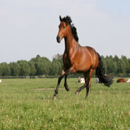
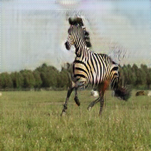
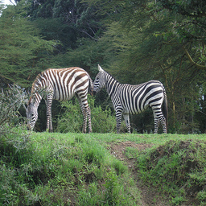
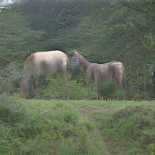
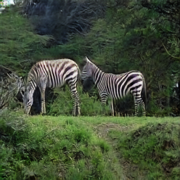

# CycleGAN

## Unpaired Image-to-Image Translation using Cycle-Consistent Adversarial Networks
by Jun-Yan Zhu, Taesung Park, Phillip Isola, Alexei A. Efros

### Abstract
_Image-to-image translation is a class of vision and graphics problems where the goal is to learn the mapping between an input image and an output image using a train- ing set of aligned image pairs. However, for many tasks, paired training data will not be available. We present an approach for learning to translate an image from a source domain X to a target domain Y in the absence of paired examples. Our goal is to learn a mapping G : X → Y such that the distribution of images from G(X) is indistin- guishable from the distribution Y using an adversarial loss. Because this mapping is highly under-constrained, we cou- ple it with an inverse mapping F : Y → X and introduce a cycle consistency loss to enforce F(G(X)) ≈ X (and vice versa). Qualitative results are presented on several tasks where paired training data does not exist, including collec- tion style transfer, object transfiguration, season transfer, photo enhancement, etc. Quantitative comparisons against several prior methods demonstrate the superiority of our approach._

```
@misc{zhu2020unpaired,
      title={Unpaired Image-to-Image Translation using Cycle-Consistent Adversarial Networks}, 
      author={Jun-Yan Zhu and Taesung Park and Phillip Isola and Alexei A. Efros},
      year={2020},
      eprint={1703.10593},
      archivePrefix={arXiv},
      primaryClass={cs.CV}
}
```

## Train/Test

- Download a CycleGAN dataset (e.g. maps):
```bash
bash ./datasets/download_cyclegan_dataset.sh maps
```

- Train a model:
```bash
python train.py
```
To see more intermediate results, check out `./saved_images_CycleGAN/`.
- Test the model:
```bash
python test.py
```

The test results will be saved here: `.datasets/horse2zebra/`.

Or apply a pre-trained model: [Pretrained weights](https://github.com/wcaine/CycleGAN/releases/tag/v1.0).

Extract the zip file and put the `.pth` files in here: `./saved_images_CycleGAN/`. Make sure you put LOAD_MODEL=True in the config.py file.

## Example Results

| Input | Generated | Reconstructed |
| --- | --- | --- |
|  |  |  |
|  |  |  |

## Acknowledgments
Code is inspired by [junyanz](https://github.com/junyanz/pytorch-CycleGAN-and-pix2pix) and [aladdinpersson](https://github.com/aladdinpersson/Machine-Learning-Collection/tree/master/ML/Pytorch/GANs/CycleGAN).